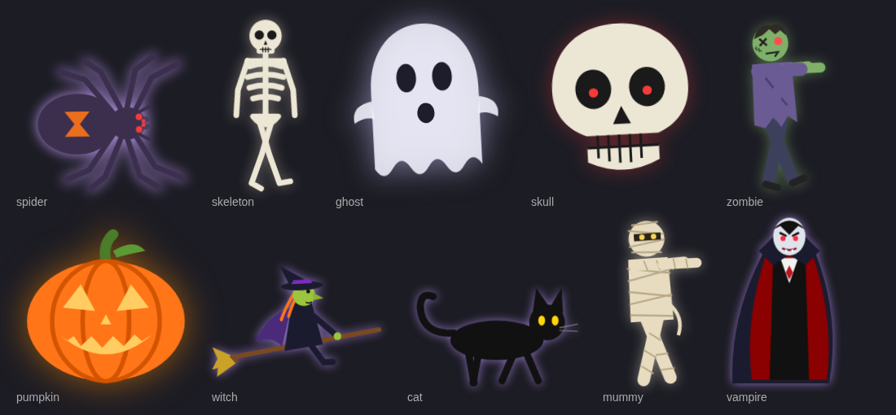

> **About this fork**
>
> This is a fork of [misterm2310/ambient-overlay-card](https://github.com/misterm2310/ambient-overlay-card).
> All credit for Ambient Overlay Card goes to its creator, **[misterm2310](https://github.com/misterm2310)**:
> thank you for a lovely card! 🙏
>
> Changes in this fork:
> * 🎃 **Halloween add-ons**: `halloween-card` puts the whole Halloween theme on your dashboard with one line.
>   It combines `halloween-bats-card`, `halloween-figures-card` (skeleton, ghost, skull, zombie, pumpkin, witch,
>   cat, mummy, vampire, a spider and spider swarms) and three effects of this card.
>   (see [Halloween add-ons](#-halloween-add-ons) below).
> * All texts translated to English: the editor UI, code comments and this README.
>   The card's behaviour and configuration options are unchanged.

---

# Ambient Overlay Card for Home Assistant

A custom Lovelace card for Home Assistant that lays dynamic animations over your dashboard. It covers real weather (rain, snow, hail, lightning, fog, storm, drifting clouds) and sky phenomena (starry sky, shooting stars, wishing star, comet, moon with the real moon phase). It also has animals, decorations and occasions: autumn leaves, birthday mode, Santa Claus, a spider with its web, a golden Labrador, a steam train with optional festive loads, bats, a bee swarm, and an owl with a birdhouse. It includes a visual GUI editor with a **live preview**, automatic theme matching, and a weather automation with real combined effects.

---

## 🎨 Features

* **23 individually selectable effects**, grouped sensibly in the editor dropdown (weather → sky/night → decoration/occasion → animals). The starry sky, moon and sun come automatically through the weather automation. See the table further down.
* **🚂 Steam train with a variable number of wagons:** It runs along the bottom edge of the screen. The locomotive has a boiler, chimney, cab with a small flag, cowcatcher and wheels, and visible steam rises from the chimney. All wagon windows and the cab window are lit warmly, and a small headlamp sits on the nose. On a normal day the four fixed wagons carry fruit, toy blocks, mail sacks and firewood. Two optional sensors switch them to a festive Christmas load (snowman, Santa, presents, sack of presents) or a dinner load (dishes, roast, dessert, drinks). More wagons make the train longer; they are never squashed. Two small surprises: the locomotive toots on every pass (a "TOOT" speech bubble), and very rarely a steam puff briefly turns into a heart.
* **👥 Person wagons:** Every person ticked in the editor who is **at home** according to their `person.` entity gets a wagon at the back with a large profile picture (or their initial if there is no picture). When someone comes home or leaves, the train updates immediately.
* **🎟️ Guest wagons from a sensor:** You can pick a sensor (e.g. an `input_text`) that contains comma-separated names, and a wagon is attached for **each name**. This is handy for a dinner guest list: enter "Marcel, Rudolf" and two extra wagons roll along. The train reacts as soon as the list changes. A fixed text works too.
* **🚦 Last wagon:** The very end of the train is always a small two-wheeled wagon with two lamps that blink red and green in turn, like a level-crossing signal.
* **🎅 Sensor-controlled festive load:** You can pick an `input_boolean`/`binary_sensor` (e.g. for the Christmas season). When it is "on", the four wagons carry a festive load instead: a big snowman with a top hat, Santa between two presents, two large wrapped parcels, and a bulging sack of presents.
* **🌫️ Smooth fade-out instead of abrupt disappearance:** When the weather changes by itself with the weather automation active, the old effect fades out gently. A manual change in the editor still switches immediately.
* **👁️ Live preview in the editor:** A small, scaled-down preview at the top of the editor updates while you adjust the controls, without saving.
* **🌦️ Optional weather automation:** Instead of choosing an effect manually, the card can follow a real `weather.*` entity and show the matching effect automatically.
* **⛈️ Real combined effects:** If the weather entity reports "snowy-rainy", snow **and** rain run at the same time. With "lightning-rainy", lightning **and** rain run together.
* **☃️ Growing snow cover:** When snow has been falling for a while, a thin layer of snow slowly builds up along the bottom of the screen.
* **🎂 Birthday mode:** A combined effect with four parts you can switch on and off individually: rising balloons, falling confetti, a bunting banner with your own text (default "Happy Birthday!"), and blinking fairy lights.
* **🎅🐕☄️🚂🐦 Figures passing periodically:** Santa, the Labrador, the comet, the steam train and the bird visiting the birdhouse pass by periodically instead of being visible all the time. "Amount / frequency" sets how often. Santa occasionally (about every 3rd pass) drops a present out of the sleigh.
* **🕷️ Spider with web:** A mathematically generated, symmetric web in the top right. A spider with blinking red eyes climbs up and down it. Halfway down it loses its grip, scrambles back up, and acts as if nothing happened.
* **🐕 Golden Labrador:** It runs with real leg movement (diagonal leg pairs swing opposite each other, like a real trot). It wags its tail, nods its head, stops briefly to sniff halfway through, and leaves fading paw prints. Optionally it shakes itself when a chosen weather entity reports rain.
* **🦇 Bats:** Several flapping silhouettes spread across the whole screen. They are coloured according to the theme so they stay visible on **any** theme.
* **🦉🐦 Owl & birdhouse:** A combined effect in the top left that switches with the sun. During the day you see the birdhouse, with a bird flying by from time to time. At night the owl sits on its branch, with feather texture, ear tufts and alternating blinks. It switches via `sun.sun`, with no extra configuration.
* **🐝 Bee swarm:** 5-8 bees at once, each on its own zigzag path across the whole screen.
* **🌤️ Drifting clouds:** Several soft, slightly blurred clouds drift across the whole screen. They are coloured according to the theme and evenly staggered in time, so at least one cloud is visible almost all the time.
* **🌠 Night sky:** A combined effect with three parts you can switch on and off individually: shooting stars, a twinkling wishing star (one star lights up, vanishes and flashes again somewhere else), and a rare, dramatic comet with a long tail.
* **✨ Starry sky with teleport effect:** Every star jumps between several random positions. It runs entirely in CSS, so it is light on resources even on weaker devices. It only runs through the weather automation (on clear nights) and can no longer be selected on its own. This avoids duplicate stars if you also have a separate starry-sky card.
* **🌙 Moon with the real moon phase:** It appears in the top right (mirroring the owl/birdhouse position) as soon as the sun has set. It does not depend on the weather, so it also shows with rain or snow at night. The phase (new moon to full moon) is calculated from the current date, with no extra sensor. Craters are only visible in the lit part. Only available through the weather automation.
* **☀️ Sun when "sunny":** It shares its spot with the moon (day and night never overlap) and has a warm, gently pulsing glow. Only available through the weather automation.
* **🌗 Auto theme mode with view theme support:** It detects light/dark mode automatically, even when the theme is only set on a single dashboard view.
* **✨ A real "Strong" setting:** At maximum opacity every effect becomes noticeably stronger.
* **Context-aware GUI editor:** The editor only shows the controls that actually do something for the selected effect.
* **🔒 Security:** Custom leaf SVG shapes are checked against a whitelist, and the birthday banner text is sanitised automatically against malicious code.
* **🔋 Battery- and resource-friendly:** Animations pause automatically when the dashboard tab is in the background. Almost all effects run purely in CSS (GPU-accelerated).
* **🎯 Robust visibility:** Effects are rendered into an independent container directly in `<body>` with an extremely high z-index. They reliably appear as a full-screen overlay, even above other custom cards with their own transition animations.

---

## 📦 Installation

### Via HACS (recommended)

> **Installing this fork:** you cannot install this fork and the original card side by side. Both install into the same folder (`/config/www/community/ambient-overlay-card/`). If you already have the original, remove it in HACS first.

1. Open **HACS** in your Home Assistant sidebar.
2. Click the three dots (`⋮`) in the top right → **Custom repositories**.
3. Add the repository URL:
   * this fork (English UI + Halloween add-ons): `https://github.com/michael-jakobsen-dk/ambient-overlay-card`
   * or the original: `https://github.com/misterm2310/ambient-overlay-card`
4. Select **Dashboard** (called **Lovelace** in older HACS versions) as the type.
5. Click **Add**, open the repository and click **Download**.
6. Reload your dashboard (`Ctrl` + `F5`).

HACS registers `ambient-overlay-card.js` as a dashboard resource automatically. To use the Halloween add-ons from this fork as well, see [Installing the Halloween add-ons](#installing-the-halloween-add-ons).

---

### Manual installation

1. Download `ambient-overlay-card.js` from the latest release.
2. Copy the file to your Home Assistant folder: `/config/www/ambient-overlay-card.js`.
3. In Home Assistant go to **Settings → Dashboards → three dots in the top right → Resources**.
4. Add a new resource:
   * **URL:** `/local/ambient-overlay-card.js`
   * **Type:** JavaScript module
5. Reload your dashboard.

> 💡 **Tip if an update does not show up:** this is almost always the browser cache. Do a hard reload (`Ctrl` + `Shift` + `R`), or add `?v=2` to the resource URL (and increase the number on each later update).

---

### 🔄 Migrating from the previous card

This card used to be called **Weather & Event Overlay Card** (`weather-event-overlay-card`). If you are coming from that version, change three things:

1. **Resource:** Remove the old resource URL (`/local/weather-event-overlay-card.js`) and add the new one (`/local/ambient-overlay-card.js`). With HACS, remove the old repository and add the new one instead.
2. **Dashboard cards:** In every card, change `type: custom:weather-event-overlay-card` to `type: custom:ambient-overlay-card`.
3. **Reload:** Do a hard reload (`Ctrl` + `Shift` + `R`).

All configuration options (`event`, `count_preset`, `person_entities`, ...) stay the same, so changing the type is all you need to do.

### ⚠️ Merged and removed effects

To keep the list of effects manageable, several effects were merged. The old `event` values **no longer work** and must be replaced:

| Old | New |
|---|---|
| `owl`, `birdhouse` | `owl_birdhouse` (switches by itself based on the sun) |
| `shooting_stars`, `wishstar`, `comet` | `night_sky` (parts can be switched off individually) |
| `balloons`, `lights` | `birthday` (parts can be switched off individually) |
| `rain`, `snow`, `hail`, `lightning`, `fog`, `storm`, `clouds` | `weather_auto` – these effects now only run via the weather automation |
| `gnome_door` | removed without replacement |

---

## 🖱️ Setup with the GUI editor (recommended)

Add a card to the dashboard → choose **Ambient Overlay Card** → in the editor:

1. At the top you see a **live preview**, which updates automatically while you change the settings below.
2. Choose an **Effect**. Pick either a fixed effect (night sky, owl & birdhouse, steam train, birthday mode, ...) or **"🌦️ Automatic (follows weather)"**. The pure weather effects (rain, snow, hail, lightning, fog, storm, clouds) are deliberately **not** in the list on their own; they only run through the weather automation.
3. With "Automatic", a **Weather sensor** field appears below. Pick your `weather.*` entity from the list.
4. With "🎂 Birthday mode", a field for the **Banner text** appears below.
5. With "🚂 Steam train", several optional fields appear:
   * **Christmas sensor**: pick an `input_boolean`/`binary_sensor` here, and the train switches to the festive load whenever that sensor is "on".
   * **Dinner sensor**: the same for the dinner load (Christmas takes precedence).
   * **Person wagons**: a checkbox list of all `person.` entities. Every ticked person who is currently at home gets their own wagon. The wagon order follows the order in which you tick them.
   * **Guest wagons from sensor**: a dropdown with all `input_text.`, `input_select.` and `sensor.` entities. If the selected entity contains comma-separated names, you get one wagon per name.
   * **Free-text wagon**: a fixed text as an alternative if you do not want to use a sensor.
6. With "🐕 Golden Labrador", an optional **Weather sensor** field appears below. If you pick your real `weather.*` entity, the dog shakes itself briefly whenever it reports rain.
7. Adjust **Amount / frequency**, **Opacity / brightness** and, if available, **Colour mode** to taste.

The editor only shows the controls that actually do something for the selected effect:
* **Santa, dog, steam train, owl & birdhouse, leaves, bees and birthday mode** have no colour mode (fixed colours).
* The **spider** has no amount setting (there is only one).
* For **Santa, dog, steam train, birdhouse, comet and leaves**, "Amount / frequency" does NOT set a particle count. It sets how often something happens (passing, flying by, a gust of wind).
* For **bats, bees, drifting clouds and birthday mode**, "Amount" is a normal particle count.

### 🌦️ How the weather automation works

With "Automatic" active, the card looks at the current state of your chosen weather entity and translates it into one effect, or two simultaneous effects for combined states:

| HA weather state | Effect(s) |
|---|---|
| `rainy`, `pouring` | 🌧️ Rain |
| `snowy` | ❄️ Snow |
| `snowy-rainy` | ❄️ Snow **+** 🌧️ rain at the same time |
| `hail` | 🧊 Hail |
| `lightning` | ⚡ Lightning |
| `lightning-rainy` | ⚡ Lightning **+** 🌧️ rain at the same time |
| `fog` | 🌫️ Fog |
| `windy`, `windy-variant` | 💨 Storm |
| `cloudy`, `partlycloudy` | 🌤️ Drifting clouds |
| `clear-night` | ✨ Starry sky |
| `sunny` | ☀️ Sun (daytime only) |
| anything else | Off |

**In addition, independent of the weather state:** As soon as the sun has set (`sun.sun` = `below_horizon`), the **🌙 moon** appears automatically in the top right. It shows on top of any weather effect that is running, so you can get rain and the moon together at night. The moon phase is calculated from the current date, with no extra sensor. The sun is hidden at night even if the weather entity still reports "sunny"; both sit in the same spot and would otherwise overlap.

**Important:** With the automation active, amount, opacity and colour mode are **one shared value for all possible weather effects**. None of the animal, decoration and occasion effects (Santa, dog, steam train, bats, bees, spider, leaves, night sky, owl & birdhouse, birthday mode) run through the weather automation. When the weather automation switches effects, the old effect fades out gently. A manual change in the editor switches immediately.

---

## ⚙️ Usage (YAML)

### Weather automation
```yaml
type: custom:ambient-overlay-card
event: weather_auto
weather_entity: weather.home
count_preset: medium
opacity_preset: medium
color_mode: auto
```

### Steam train with sensor-controlled festive load
```yaml
type: custom:ambient-overlay-card
event: train
count_preset: medium
opacity_preset: high
santa_sensor: input_boolean.christmas_season
dinner_sensor: input_boolean.dinner_switch
person_entities: person.marco, person.sandra
custom_wagon_entity: input_text.guests
```

### Steam train with fixed guest names (no sensor)
```yaml
type: custom:ambient-overlay-card
event: train
count_preset: medium
opacity_preset: high
custom_wagon_text: Marcel, Rudolf
```

#### 🚃 Wagon order

Counted from the locomotive (the locomotive drives in front):

* **Position 1:** the locomotive
* **Positions 2–5:** the four fixed wagons (everyday, Christmas or dinner load)
* **then:** the person wagons, in the order you ticked them in the editor. The person ticked first is closest to the locomotive.
* **then:** the guest wagons, in the order the names appear in the sensor or free text
* **at the very end:** the last wagon with the blinking lamps, always the final element

### Golden Labrador shaking in the rain (optional)
```yaml
type: custom:ambient-overlay-card
event: dog
count_preset: medium
opacity_preset: high
weather_entity: weather.home
```

### Owl & birdhouse (switches with the sun)
```yaml
type: custom:ambient-overlay-card
event: owl_birdhouse
count_preset: medium
opacity_preset: high
```
The birdhouse shows during the day and the owl after sunset. `count_preset` controls how often a bird flies past the birdhouse.

### Spider with web (auto colour mode)
```yaml
type: custom:ambient-overlay-card
event: spider
opacity_preset: medium
color_mode: auto
```

### Birthday mode with your own text
```yaml
type: custom:ambient-overlay-card
event: birthday
birthday_text: "Happy Birthday, Max!"
count_preset: medium
opacity_preset: high
```

### Bats (theme-dependent)
```yaml
type: custom:ambient-overlay-card
event: bats
count_preset: medium
opacity_preset: high
color_mode: auto
```

### Bee swarm
```yaml
type: custom:ambient-overlay-card
event: bee
count_preset: medium
opacity_preset: medium
```

### Night sky (all parts)
```yaml
type: custom:ambient-overlay-card
event: night_sky
count_preset: low
opacity_preset: high
color_mode: auto
```

### Night sky – comet only
```yaml
type: custom:ambient-overlay-card
event: night_sky
count_preset: low
opacity_preset: high
night_shooting_stars: false
night_wishstar: false
night_comet: true
```

### Autumn leaves with your own colour gradient (YAML only)
```yaml
type: custom:ambient-overlay-card
event: leaves
count_preset: medium
opacity_preset: medium
leaf_colors:
  - "#c9a227"
  - "#a83232"
  - "#d9812c"
```

---

## 🧩 Available effects

| `event` | Description |
|---|---|
| `off` | No effect (default) |
| `weather_auto` | 🌦️ Automatic, follows a real weather entity, including combined effects (see above) |
| `night_sky` | 🌠 Night sky: combines shooting stars, wishing star and comet, each can be switched off |
| `owl_birdhouse` | 🦉🐦 Owl & birdhouse: switches automatically with the sun (birdhouse by day, owl by night) |
| `birthday` | 🎂 Birthday mode: combines balloons, confetti, a banner with your own text and fairy lights, each can be switched off |
| `leaves` | 🍂 Periodic gust of autumn wind with a 3-colour gradient |
| `santa` | 🎅 Santa with sleigh & 2 reindeer (passes periodically, occasionally drops a present) |
| `train` | 🚂 Steam train with four wagons (fruit / toy blocks / mail sacks / wood, optionally a festive or dinner load via sensors), lit windows, headlamp, steam from the chimney, a toot, and very rarely heart-shaped steam. Can be extended with person wagons, guest wagons from a sensor and a blinking last wagon |
| `dog` | 🐕 Golden Labrador with real running leg movement, a sniffing pause and paw prints (optionally shakes in the rain) |
| `spider` | 🕷️ Spider web with a spider climbing up and down (blinking red eyes, briefly loses its grip) |
| `bats` | 🦇 Swarm of bats, coloured according to the theme |
| `bee` | 🐝 Bee swarm (5-8 bees) flying in zigzags |

### Weather automation only

These effects **cannot** be selected on their own. They only appear when `event: weather_auto` is set and the weather entity reports the matching state:

| Effect | When |
|---|---|
| 🌧️ Rain | `rainy`, `pouring` |
| ❄️ Snow (with growing snow cover) | `snowy`, `snowy-rainy` |
| 🧊 Hail | `hail` |
| ⚡ Lightning / thunderstorm | `lightning`, `lightning-rainy` |
| 🌫️ Fog | `fog` |
| 💨 Storm / gusts | `windy`, `windy-variant` |
| 🌤️ Drifting clouds | `cloudy`, `partlycloudy` |
| ✨ Starry sky | `clear-night` |
| ☀️ Sun with a warm glow | `sunny`, but only while the sun is above the horizon |
| 🌙 Moon with the real moon phase | as soon as the sun has set, regardless of the weather |

---

## 🔧 Configuration options

| Option | Type | Default | Description |
|---|---|---|---|
| `event` | string | `off` | Which effect is active, or `weather_auto` for the weather automation (see table above) |
| `weather_entity` | string | `""` | Entity ID of a `weather.*` entity, e.g. `weather.home`. With `event: weather_auto` it decides the effect; with `event: dog` it is optional and used for shaking in the rain |
| `birthday_text` | string | `"Happy Birthday!"` | Text on the banner (only for `event: birthday`), sanitised automatically against malicious code |
| `birthday_balloons` | bool | `true` | Show balloons in birthday mode |
| `birthday_confetti` | bool | `true` | Show falling confetti in birthday mode |
| `birthday_banner` | bool | `true` | Show the bunting banner with text in birthday mode |
| `birthday_lights` | bool | `true` | Show blinking fairy lights in birthday mode |
| `night_shooting_stars` | bool | `true` | Show shooting stars in the night sky effect |
| `night_wishstar` | bool | `true` | Show the twinkling wishing star in the night sky effect |
| `night_comet` | bool | `true` | Show the comet in the night sky effect |
| `santa_sensor` | string | `""` | Entity ID of an `input_boolean`/`binary_sensor` (only for `event: train`). When it is "on", the four wagons carry a festive load instead of the everyday load |
| `dinner_sensor` | string | `""` | Entity ID of an `input_boolean`/`binary_sensor` (only for `event: train`). When it is "on", the four wagons carry dishes, a roast, dessert and drinks instead of the everyday load. `santa_sensor` takes precedence if both are on |
| `person_entities` | string | `""` | Comma-separated list of `person.` entities (only for `event: train`). A wagon with the profile picture (if available) or initial is attached for every person currently at home. The editor shows this as a checkbox list; this field is only needed when writing YAML directly |
| `custom_wagon_entity` | string | `""` | Entity ID of a sensor with comma-separated names, e.g. `input_text.guests` (only for `event: train`). A wagon is attached for **each name**. The editor shows a dropdown (`input_text.`, `input_select.`, `sensor.`). Takes precedence over `custom_wagon_text`. If the sensor is empty or `unknown`/`unavailable`, there are no guest wagons |
| `custom_wagon_text` | string | `""` | Fixed text for extra wagons (only for `event: train`) if no sensor is selected. Separate several names with commas to get several wagons, e.g. `Marcel, Rudolf` |
| `count_preset` | `low` \| `medium` \| `high` | `medium` | Amount or frequency; the meaning depends on the effect (see the editor hints above) |
| `opacity_preset` | `low` \| `medium` \| `high` | `medium` | Opacity/brightness of the effect |
| `color_mode` | `auto` \| `custom` | `auto` | Automatic theme detection or a fixed colour (only for effects with a colour mode) |
| `color` | string (hex) or `auto` | `auto` | Custom colour for effects with a colour mode (night sky, bats, spider web and the weather effects of the automation) |
| `leaf_colors` | array of 3 hex colours | `["#c9a227", "#a83232", "#d9812c"]` | Colour gradient for the leaves effect (YAML only, not in the GUI editor) |
| `leaf_shape` | string (SVG path) | built-in shape | Optional custom leaf shape, YAML only (security-checked) |

---

## 🎃 Halloween add-ons

Added in this fork: three Lovelace cards that put your dashboard into Halloween mode.



### `halloween-card`: the whole theme in one card

```yaml
type: custom:halloween-card
```

That one line gives you everything: bats, the random Halloween figures and spider swarms, plus a spider web, orange/purple autumn leaves and the night sky from Ambient Overlay Card. When Halloween is over, delete the card.

Every part is on by default. Set a part to `false` to turn it off, or give it an object to change its options. The options are the same as on the individual cards described below.

```yaml
type: custom:halloween-card
bats:
  size: 80
figures:
  min_interval: 120
  figures: [ghost, pumpkin, witch, spiders]
leaves: false
```

| Part | Runs | Default options |
|---|---|---|
| `bats` | `halloween-bats-card` | `size: 60`, `min_duration: 22`, `max_duration: 34` |
| `figures` | `halloween-figures-card` | the card's own defaults |
| `spider_web` | `ambient-overlay-card` with `event: spider` | `opacity_preset: medium` |
| `leaves` | `ambient-overlay-card` with `event: leaves` | `count_preset: low`, `opacity_preset: medium`, orange/purple `leaf_colors` |
| `night_sky` | `ambient-overlay-card` with `event: night_sky` | `count_preset: low`, `opacity_preset: low` |

The `event` of the three Ambient Overlay Card parts is fixed; all their other options can be changed. `halloween-card` needs the other three cards loaded as resources (see [Installing the Halloween add-ons](#installing-the-halloween-add-ons)). If one is missing, that part is skipped and a warning is logged in the browser console.

To show Halloween only at certain times, use Home Assistant's own tools, e.g. a [conditional card](https://www.home-assistant.io/dashboards/conditional/) around `halloween-card` that checks an `input_boolean`.

### `halloween-bats-card`

Bats flying across the full screen. The bat shape and flight path are adapted from the `bats` effect by misterm2310. Unlike the built-in effect, you can set the size and speed.

```yaml
type: custom:halloween-bats-card
count: 8           # number of bats
size: 60           # width in px (the built-in effect uses 40)
min_duration: 22   # seconds to cross the screen, higher = slower
max_duration: 34
color: "#cbc4d9"
opacity: 0.7
```

| Option | Default | Description |
|---|---|---|
| `count` | `8` | Number of bats |
| `size` | `60` | Bat width in px |
| `min_duration` / `max_duration` | `14` / `22` | Seconds for one bat to cross the screen (each bat picks a random value in between) |
| `color` | `#cbc4d9` | Bat colour |
| `opacity` | `0.7` | Overall opacity |

### `halloween-figures-card`

Every few minutes a large Halloween figure walks, floats, hops, flies or crawls across the screen. The wait and the choice of figure are both random, and the same figure never comes twice in a row. Each figure picks a random direction. Walkers stay on the bottom edge; flyers use the upper part of the screen.

Figures: `skeleton`, `ghost`, `skull`, `zombie`, `pumpkin`, `witch`, `cat`, `mummy`, `vampire`, `spider` and `spiders`.

The spiders are drawn from above, with legs that move in an alternating gait and glowing red eyes. They crawl in a slight zigzag anywhere on the screen. `spider` sends one large spider across. `spiders` sends a swarm of 2 up to `max_spiders` (default 10) smaller spiders. Each one in the swarm has its own size, direction, path and speed, and they start a few seconds apart.

```yaml
type: custom:halloween-figures-card
min_interval: 180   # seconds between figures (random between min and max)
max_interval: 480
size: 600           # px along the longest side, capped at 80% of the screen height
speed_factor: 0.5   # overall speed; higher = faster
opacity: 0.95
spider_size: 280      # px, single spider
swarm_spider_size: 110
max_spiders: 10       # a swarm has 2..max_spiders spiders
figures: [skeleton, ghost, skull, zombie, pumpkin, witch, cat, mummy, vampire, spider, spiders]
# first_delay: 5    # optional, for testing: first figure after 5 s
```

| Option | Default | Description |
|---|---|---|
| `min_interval` / `max_interval` | `180` / `480` | Seconds between two figures (random in between) |
| `size` | `600` | Size in px along the figure's longest side, capped at 80% of the screen height |
| `speed_factor` | `0.5` | Overall speed (`0.5` = half the average speed of `halloween-bats-card` with its default settings) |
| `opacity` | `0.95` | Overall opacity |
| `spider_size` | `280` | Size in px of the single `spider` |
| `swarm_spider_size` | `110` | Size in px of the spiders in a swarm (each one is 60–100% of this) |
| `max_spiders` | `10` | Maximum number of spiders in a swarm (a swarm has at least 2) |
| `figures` | all | Which figures may appear |
| `first_delay` | – | Seconds until the first figure (for testing). Without it, the first figure also waits a random interval |

Each figure also has its own base speed, which is multiplied by a random factor between 0.7 and 1.4 on every crossing. This way the same figure can be slow one time and quicker the next:

| Figure | Base speed |
|---|---|
| 🧙 witch | 2.0 (fastest) |
| 🐈‍⬛ cat | 1.6 |
| 🕷️ spiders (swarm) | 1.6 |
| 🕷️ spider | 1.4 |
| 🎃 pumpkin | 1.3 |
| 💀 skeleton | 1.0 |
| ☠️ skull | 0.9 |
| 🧛 vampire | 0.8 |
| 👻 ghost | 0.7 |
| 🧟 zombie | 0.55 |
| 🧻 mummy | 0.45 (slowest) |

### Installing the Halloween add-ons

**With HACS:** if you installed this fork through HACS (see [Installation](#-installation)), the two files are already on your system. HACS downloads every `.js` file in the repository root, but it only registers the main card as a resource automatically. Add the other three yourself:

1. Go to **Settings → Dashboards → ⋮ → Resources → Add resource**.
2. Add each of these as **JavaScript module**:
   * `/hacsfiles/ambient-overlay-card/halloween-bats-card.js`
   * `/hacsfiles/ambient-overlay-card/halloween-figures-card.js`
   * `/hacsfiles/ambient-overlay-card/halloween-card.js`
3. Reload the browser (clear the cache if the cards do not show up).

> 💡 HACS updates the version tag of the main card's resource for you, but not of resources you added yourself. After updating the fork, add or bump a version on these URLs (e.g. `...halloween-figures-card.js?v=2`) so browsers fetch the new files.

**Without HACS:** copy `halloween-bats-card.js`, `halloween-figures-card.js` and `halloween-card.js` (plus `ambient-overlay-card.js`) to `/config/www/`. Then add them as resources with URLs like `/local/halloween-card.js` (type **JavaScript module**).

All the Halloween cards take up no space on the dashboard, and their overlays use `pointer-events: none`, so everything underneath stays fully usable.

### Example: building the set by hand

`halloween-card` is the easy way. If you want full control, for example a different Ambient Overlay Card effect, you can build the same set yourself. Put the cards in one `vertical-stack` at the end of a view, so you only have to delete that one stack when the season is over.

```yaml
type: vertical-stack
cards:
  - type: custom:halloween-bats-card
    size: 60
    min_duration: 22
    max_duration: 34
  - type: custom:ambient-overlay-card
    event: spider
  - type: custom:ambient-overlay-card
    event: leaves
    count_preset: low
    leaf_colors: ["#ff7518", "#7b2cbf", "#e85d04"]
  - type: custom:ambient-overlay-card
    event: night_sky
    count_preset: low
    opacity_preset: low
  - type: custom:halloween-figures-card
```

---

## 📄 License

MIT, as declared by the original author [misterm2310](https://github.com/misterm2310). The Halloween add-ons in this fork are released under the same licence.
