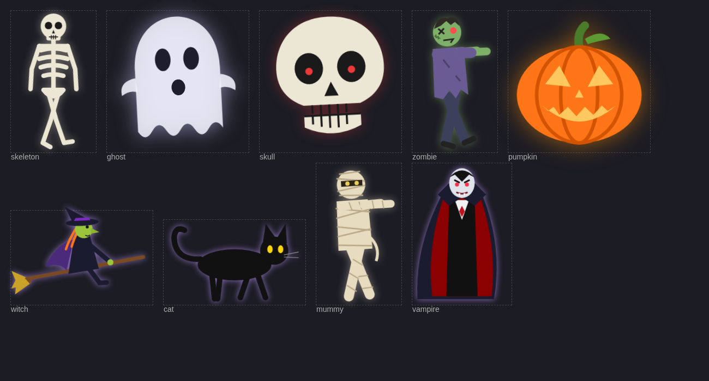

# Halloween add-ons for Ambient Overlay Card

Two standalone Lovelace cards that turn a Home Assistant dashboard into Halloween mode.
They are meant to sit next to [Ambient Overlay Card](https://github.com/misterm2310/ambient-overlay-card)
(for example its `spider`, `leaves` and `night_sky` effects), but neither one depends on it.



## Credits

All credit for the original Ambient Overlay Card goes to **[misterm2310](https://github.com/misterm2310)**.
`halloween-bats-card` reuses the bat shape and flight path from its `bats` effect, with size
and speed made configurable. The figures in `halloween-figures-card` are new.

## Cards

### `halloween-bats-card`

Bats flying across the full screen. Unlike the built-in `bats` effect, you can set their size and speed.

```yaml
type: custom:halloween-bats-card
count: 8           # number of bats
size: 60           # width in px (the original effect uses 40)
min_duration: 22   # seconds to cross the screen, higher = slower
max_duration: 34
color: "#cbc4d9"
opacity: 0.7
```

### `halloween-figures-card`

Every few minutes a large figure walks, floats, hops or flies across the screen. The wait and
the choice of figure are both random, and the same figure never comes twice in a row.

Figures: `skeleton`, `ghost`, `skull`, `zombie`, `pumpkin`, `witch`, `cat`, `mummy`, `vampire`.

```yaml
type: custom:halloween-figures-card
min_interval: 180   # seconds between figures (random between min and max)
max_interval: 480
size: 600           # px along the longest side, capped at 80% of screen height
speed_factor: 0.5   # overall speed; higher = faster
opacity: 0.95
figures: [skeleton, ghost, skull, zombie, pumpkin, witch, cat, mummy, vampire]
# first_delay: 5    # optional, for testing: first figure after 5 s
```

Each figure has its own base speed, from the fast witch (2.0) down to the slow mummy (0.45).
Each crossing multiplies it by a random factor between 0.7 and 1.4, so the same figure can be
slow one time and quicker the next. Figures pick a random direction, and walkers stay on the
bottom edge while flyers use the upper part of the screen.

## Installation

HACS only installs `ambient-overlay-card.js` from this repository, so add these two cards by hand:

1. Copy `halloween-bats-card.js` and/or `halloween-figures-card.js` to `/config/www/`.
2. Go to **Settings → Dashboards → ⋮ → Resources** and add `/local/halloween-bats-card.js`
   and `/local/halloween-figures-card.js` as **JavaScript module**.
3. Add the cards to a view. They take up no space; the overlays have `pointer-events: none`,
   so the dashboard underneath stays fully usable.
4. Reload the browser (clear the cache if the cards do not show up).

Tip: put all Halloween cards in one `vertical-stack` at the end of a view. You can then delete
that one stack when the season is over.

## Example

```yaml
type: vertical-stack
cards:
  - type: custom:halloween-bats-card
    size: 60
    min_duration: 22
    max_duration: 34
  - type: custom:ambient-overlay-card
    event: spider
  - type: custom:ambient-overlay-card
    event: leaves
    count_preset: low
    leaf_colors: ["#ff7518", "#7b2cbf", "#e85d04"]
  - type: custom:ambient-overlay-card
    event: night_sky
    count_preset: low
    opacity_preset: low
  - type: custom:halloween-figures-card
```
